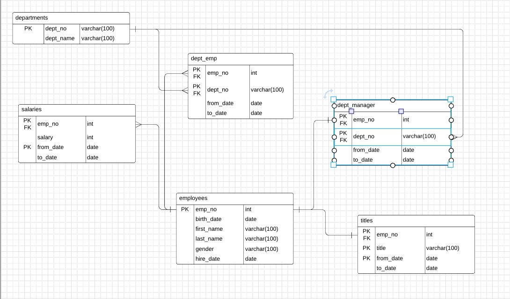
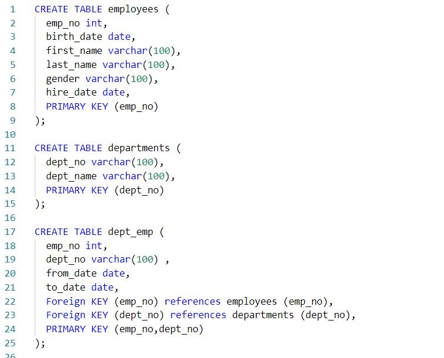
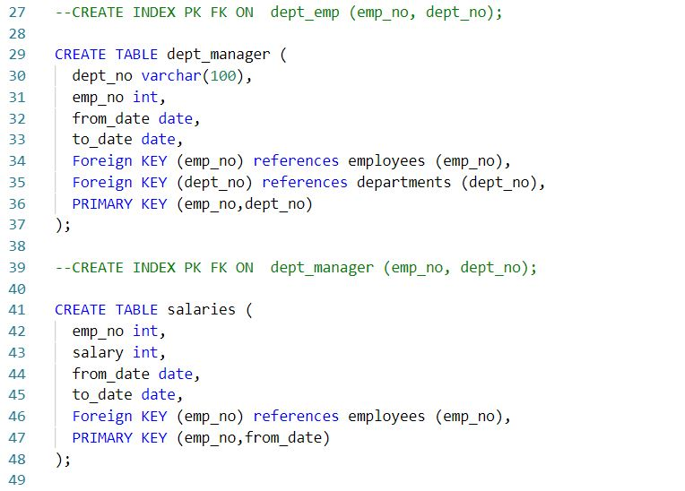
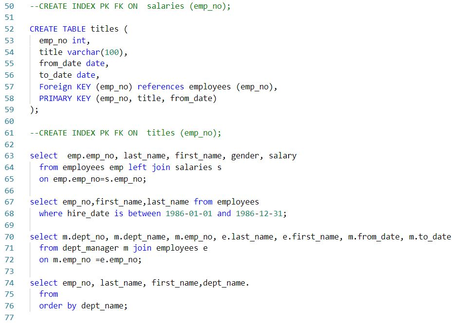

# SQL_Employee_Analysis
This project analyzes data from multiple CSVs by creating, storing, and querying data in PostgreSQL.  

## Tasks:
To complete this assignment, the following tasks were performed:
* Create a localhost connection to a PostgreSQL server and have successfully connect to it. 
* Create, use, and populate a SQL database with data. 
* Create, populate, and select data from a SQL table. 
* Import large CSV datasets into pgAdmin. 
* Use pgAdmin to select specific rows/columns of data out from a table. 
* Use different kinds of joins to create new tables in pgAdmin. 
* Write basic- to intermediate-level SQL statements. 
* Understanding of table design and database management. 

## ERD

## Queries and Joins

## Tools
1. PostgreSQL 
2. pgAdmin

## Procedures
1. Clone this repository
2. View ERD file to understand structure
3. Run SQL file
4. Run queries